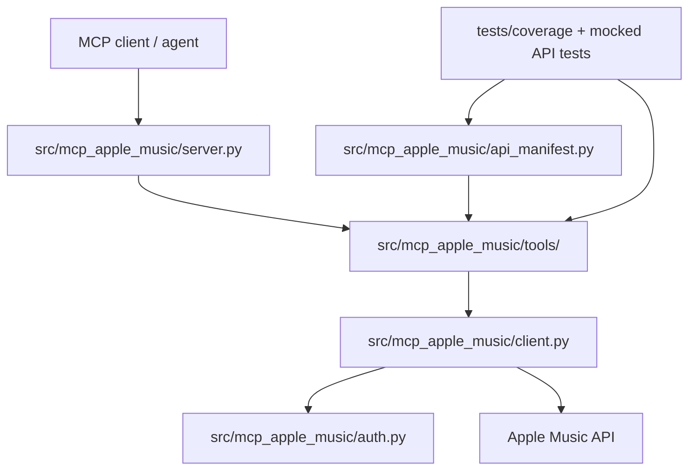

# Apple Music MCP Full API Coverage Plan

## Summary

Extend a fork of `Cifero74/mcp-apple-music` from a small curated tool set into an agent-grade Apple Music API MCP that covers every endpoint family visible in Apple Music API documentation. Preserve the existing setup/auth flow, add structured outputs, and make playlist/library write operations safe enough for Last.fm-driven automation.

---

## Problem Frame

The current MCP is a strong starting point for search, library browsing, playlist creation, and recommendations, but it exposes only 11 tools from a much wider Apple Music API surface. Our Last.fm workflow needs reliable catalog matching, playlist side effects, replay/history context, ratings/favorites, and raw IDs/metadata without forcing agents to parse formatted prose.

This plan targets the Apple Music API web-service surface used by MusicKit. It does not cover native Swift/iOS MusicKit playback APIs, local Music.app automation, or device-only media library APIs unless a separate native helper is added later.

---

## Requirements

- R1. The fork must expose every Apple Music API endpoint family present in Apple's current Apple Music API documentation topic catalog.
- R2. Every tool that returns Apple API resources must support structured output suitable for agent composition and optional human-readable formatting.
- R3. Catalog tools must cover all documented catalog resource types, relationship fetches, relationship views, batch lookups, equivalency lookups, and filter lookups such as UPC and ISRC.
- R4. Library tools must cover search, all/list/get/multiple/get-relationship operations for documented library resources, including playlist folders.
- R5. Write tools must cover documented user-library modifications: create playlist, add tracks to playlist, create playlist folder, add resource to library, ratings, and favorites.
- R6. Personalization tools must cover recommendations, history, recently played tracks, recently added resources, heavy rotation, replay data, and user storefront.
- R7. The MCP must keep side-effect operations playlist-safe: dry-run where practical, batch sizing, structured success/failure reports, and no hidden duplicate-prone behavior.
- R8. The implementation must include a machine-checkable API coverage manifest so future Apple docs changes show up as test failures or explicit drift reports.
- R9. Existing setup wizard and environment-variable auth flows must continue to work.

---

## Current Coverage Snapshot

The upstream MCP currently exposes:

| Tool | Apple API area |
| --- | --- |
| `search_catalog` | Catalog search for songs, albums, artists, playlists |
| `search_library` | Library search |
| `get_library_songs` | All library songs, paginated |
| `get_library_albums` | All library albums, paginated |
| `get_library_artists` | All library artists, paginated |
| `get_library_playlists` | All library playlists, first page only |
| `get_playlist_tracks` | Library playlist tracks |
| `create_playlist` | Create library playlist |
| `add_tracks_to_playlist` | Add tracks to library playlist |
| `get_recently_played` | Recently played resources, not tracks |
| `get_recommendations` | Default recommendations |

Major gaps include raw JSON output, direct/batch lookups, catalog relationship/view fetches, ISRC/UPC lookups, music videos, stations, activities, curators, record labels, genres, charts, playlist folders, ratings, favorites, replay data, recent tracks, recently added resources, and typed multi-resource fetches.

---

## Key Technical Decisions

- KTD1. **Use a generated endpoint manifest plus typed wrappers:** Keep ergonomic tools for common tasks, but store complete endpoint metadata in a manifest so coverage is auditable and new endpoint families can be added consistently.
- KTD2. **Return structured data first:** Default MCP responses should be JSON-like structured content. Human summaries can be an optional `format="text"` mode, not the only output.
- KTD3. **Model generic resource fetch primitives:** Many Apple endpoints share path shapes: get one, get multiple, fetch relationship, fetch view. Implement shared client helpers before adding dozens of thin tools.
- KTD4. **Keep catalog and library auth explicit:** Catalog-only calls should not require a Music User Token; `/me` calls must require it and fail with actionable setup errors.
- KTD5. **Treat writes as operations with reports:** Side-effect tools should return created IDs, attempted IDs, accepted IDs, failed IDs, API status, and continuation guidance. This matters for playlist creation from Last.fm candidates.
- KTD6. **Document unavailable operations:** If Apple's current docs do not expose update/delete/reorder for playlists or remove tracks from playlists, the MCP should state that rather than simulating it poorly.

---

## High-Level Technical Design

The implementation should first separate transport/auth from endpoint semantics, then add endpoint families in batches. The final MCP should expose enough typed tools for agent discovery while keeping a lower-level `apple_music_request` or `get_resource` escape hatch for newly documented endpoints.

---

## Implementation Units

### U1. API Coverage Manifest

- **Goal:** Add a canonical manifest of Apple Music API endpoint families and documented operations.
- **Files:** `src/mcp_apple_music/api_manifest.py`, `tests/test_api_manifest.py`, `README.md`
- **Patterns:** Derive categories from Apple's docs topic structure: catalog resources, library resources, search, ratings, genres/charts, personalization/history, favorites/replay, multi-resource fetches, storefront/test endpoints.
- **Test Scenarios:**
  - Manifest contains entries for every endpoint group listed in the 2026-06-18 Apple docs snapshot.
  - Each manifest entry declares auth mode, HTTP method, path template, parameters, supported resource types, and side-effect status.
  - A coverage test fails when a documented entry has no associated tool or explicit unsupported note.

### U2. Client Layer And Structured Response Contract

- **Goal:** Expand `AppleMusicClient` into reusable request primitives with pagination, raw JSON returns, typed errors, and response formatting.
- **Files:** `src/mcp_apple_music/client.py`, `src/mcp_apple_music/responses.py`, `tests/test_client.py`, `tests/test_responses.py`
- **Patterns:** Build on existing `get`, `post`, and `get_all_pages`; add `delete` or `put` only if Apple docs require them for current endpoint coverage.
- **Test Scenarios:**
  - Catalog requests omit `Music-User-Token`.
  - Library and personalization requests include `Music-User-Token`.
  - Pagination follows Apple `next` links or offset semantics without over-fetching.
  - HTTP errors preserve status code, response body, method, path, and safe request metadata.
  - Formatted text tools can be produced from the same structured payload without losing IDs.

### U3. Catalog Resource Coverage

- **Goal:** Cover all catalog resource endpoints and shared relationship/view patterns.
- **Files:** `src/mcp_apple_music/tools/catalog.py`, `src/mcp_apple_music/server.py`, `tests/test_catalog_tools.py`
- **Coverage:** Albums, artists, songs, music videos, playlists, stations, station genres, activities, curators, Apple curators, record labels, genres, charts, storefront resources, typed multi-resource fetches.
- **Special Lookups:** Album UPC, song ISRC, music video ISRC, equivalent catalog album/song/music-video IDs.
- **Test Scenarios:**
  - Get one and get multiple work for each catalog resource type.
  - Relationship fetch works for resource types with documented relationships.
  - Relationship view fetch works for resource types with documented views.
  - ISRC and UPC filters preserve requested identifiers in the structured result.
  - Charts and genres accept storefront, localization, genre, chart, limit, and offset parameters.

### U4. Search And Discovery Tools

- **Goal:** Expand search beyond current basic catalog/library search.
- **Files:** `src/mcp_apple_music/tools/search.py`, `tests/test_search_tools.py`
- **Coverage:** Catalog search, catalog search hints, catalog search suggestions, library search.
- **Test Scenarios:**
  - Catalog search supports all documented resource types, including activities, Apple curators, curators, music videos, record labels, stations, and playlists.
  - Search hints and suggestions return structured suggestions rather than prose only.
  - Library search supports library albums, songs, artists, playlists, and any newly documented library types in the manifest.

### U5. Library Resource Coverage

- **Goal:** Cover all documented user library read and add-resource flows.
- **Files:** `src/mcp_apple_music/tools/library.py`, `tests/test_library_tools.py`
- **Coverage:** Library albums, artists, songs, music videos, playlists, playlist folders; get one, get multiple, get all, relationship fetches, add resource to library.
- **Test Scenarios:**
  - All library collection tools support `limit`, `offset`, and structured pagination metadata.
  - Multiple-ID lookups accept typed library IDs and preserve per-ID misses.
  - Add-resource supports catalog albums, songs, music videos, and playlists according to Apple docs.
  - Playlist folder reads include root folder and child relationships.

### U6. Playlist And Playlist Folder Writes

- **Goal:** Make playlist/folder creation and playlist track addition safe and complete.
- **Files:** `src/mcp_apple_music/tools/playlists.py`, `tests/test_playlist_tools.py`
- **Coverage:** Create library playlist, add tracks to library playlist, create library playlist folder.
- **Test Scenarios:**
  - Create playlist returns structured playlist ID, href, name, and attributes.
  - Add tracks accepts both `songs` and `library-songs`, batches safely, and reports all attempted IDs.
  - Dry-run returns the exact request body without calling Apple.
  - Duplicate handling is explicit: either prefetch existing playlist tracks when requested or document that Apple/API behavior controls duplicates.
  - Create playlist folder returns structured folder ID and parent/relationship metadata when Apple returns it.

### U7. Ratings, Favorites, Replay, Recommendations, And History

- **Goal:** Cover the personalization and user-action endpoint families that the current MCP only partially exposes.
- **Files:** `src/mcp_apple_music/tools/personalization.py`, `tests/test_personalization_tools.py`
- **Coverage:** Catalog and library ratings get/multiple/add/delete for albums, songs, playlists, music videos, and stations; add resource to favorites; replay data; recommendation get/multiple/default and relationship fetches; heavy rotation; recently played resources; recently played tracks; recently played stations; recently added resources; user storefront.
- **Test Scenarios:**
  - Ratings tools validate rating values and resource domains before making API calls.
  - Delete rating uses the documented method/path and returns a structured success report.
  - Recently played tracks is distinct from recently played resources.
  - Replay data returns the documented period summaries without format loss.
  - Recommendation relationship fetch supports pagination.

### U8. Server Registration And Tool Discoverability

- **Goal:** Keep the MCP tool surface broad but navigable.
- **Files:** `src/mcp_apple_music/server.py`, `src/mcp_apple_music/tools/__init__.py`, `README.md`, `server.json`
- **Patterns:** Split tools into modules and register them from `server.py`; keep common argument names across tools: `storefront`, `ids`, `include`, `relationship`, `view`, `limit`, `offset`, `format`, `dry_run`.
- **Test Scenarios:**
  - Tool registry exposes one tool or explicit unsupported note per manifest entry.
  - Tool descriptions include auth requirements and side-effect warnings.
  - Existing upstream tool names remain as compatibility aliases where practical.

### U9. Setup, Secrets, And Operational Packaging

- **Goal:** Preserve upstream setup while making credentials usable in agent and server environments.
- **Files:** `src/mcp_apple_music/setup.py`, `src/mcp_apple_music/auth.py`, `config.example.json`, `Dockerfile`, `README.md`
- **Test Scenarios:**
  - Existing config-file setup still generates and stores a Music User Token.
  - Environment variables continue to override config file values.
  - Private key content supports literal newlines and escaped `\n`.
  - Missing user token errors distinguish catalog-only calls from user-auth calls.
  - Docker/server examples document how to pass credentials without printing them.

### U10. Documentation And Coverage Audit

- **Goal:** Make the fork maintainable as Apple changes the API.
- **Files:** `README.md`, `docs/api-coverage.md`, `tests/test_api_coverage.py`
- **Test Scenarios:**
  - Documentation lists all endpoint families and marks each as supported, unsupported by Apple, or intentionally deferred.
  - Coverage test compares tool registry to manifest.
  - README includes Last.fm playlist workflow examples without making `lfm-history` a dependency of the MCP.

---

## Endpoint Coverage Checklist

| Area | Endpoint families to cover |
| --- | --- |
| Albums | Catalog one/multiple/UPC/equivalent/relationship/view; library one/multiple/all/relationship; add to library |
| Artists | Catalog one/multiple/relationship/view; library one/multiple/all/relationship |
| Songs | Catalog one/multiple/ISRC/equivalent/relationship; library one/multiple/all/relationship; add to library |
| Music Videos | Catalog one/multiple/ISRC/equivalent/relationship/view; library one/multiple/all/relationship; add to library |
| Playlists | Catalog one/multiple/charts/relationship/view; library one/multiple/all/relationship; create playlist; add tracks; add to library |
| Playlist Folders | Root folder; one/multiple; relationship; create folder |
| Stations | Catalog one/multiple/live radio/personal station/relationship; station genres one/multiple/all/relationship |
| Search | Catalog search; search hints; search suggestions; library search |
| Ratings | Catalog get/multiple/add/delete for albums, songs, playlists, music videos, stations; library get/multiple/add/delete for albums, songs, playlists, music videos |
| Genres And Charts | Catalog genre one/multiple/all top chart genres; catalog charts |
| Activities | Catalog one/multiple/relationship |
| Curators | Catalog curators and Apple curators one/multiple/relationship |
| Record Labels | Catalog one/multiple/view |
| Favorites | Add resource to favorites |
| Replay | User replay data |
| Recommendations | One/multiple/default recommendations; recommendation relationship |
| History | Heavy rotation, recently played resources, recently played tracks, recently played stations, recently added resources |
| Multi-resource | Multiple catalog resources by resource-typed IDs; multiple library resources by resource-typed IDs |
| Essentials | User storefront; placeholder connectivity endpoint |

---

## Scope Boundaries

- Native Swift/iOS MusicKit framework APIs are outside this fork unless a native helper is introduced.
- Local Music.app control is outside this API fork; use a macOS MCP or AppleScript helper separately.
- Last.fm matching logic belongs in `lfm-history` or a bridge layer, not inside the Apple Music MCP.
- Playlist update/delete/reorder/remove-track operations are not planned unless Apple's current API docs expose them or implementation research finds documented endpoints omitted from the topic catalog.

---

## Risks And Dependencies

- **Apple docs drift:** Apple can add endpoints without package releases. Mitigation: keep the manifest explicit and add a docs snapshot refresh script or manual update procedure.
- **Large MCP surface:** Too many tools can be hard for agents to choose from. Mitigation: group tools by module, use consistent names, and offer both typed wrappers and generic resource helpers.
- **Formatted-string compatibility:** Existing users may rely on current prose outputs. Mitigation: preserve aliases or add `format="text"` compatibility.
- **Auth complexity:** Some catalog tools can work without user auth while most `/me` tools cannot. Mitigation: encode auth mode per endpoint and test missing-token behavior.
- **Playlist side effects:** Adding tracks can create messy duplicates. Mitigation: dry-run, optional existing-track prefetch, structured reports, and batching.

---

## Documentation / Operational Notes

The fork should document two usage layers:

- MCP-native use: agents call Apple Music tools directly for catalog/library work.
- Last.fm bridge use: `lfm-history` produces playlist candidates, then a separate bridge or agent workflow uses the MCP's structured search and playlist tools.

Store developer credentials and user tokens outside the repo. The MCP already supports environment variables for `APPLE_TEAM_ID`, `APPLE_KEY_ID`, `APPLE_PRIVATE_KEY`, `APPLE_MUSIC_USER_TOKEN`, and `APPLE_STOREFRONT`; keep that contract.

---

## Sources / Research

- `README.md` and `src/mcp_apple_music/server.py` in `Cifero74/mcp-apple-music` identify the current tool surface.
- Apple Music API docs root lists the endpoint categories: https://developer.apple.com/documentation/applemusicapi/
- Apple DocC JSON for the Apple Music API root and topic pages was used to enumerate current endpoint families.
- Catalog search docs identify catalog search types and related search endpoints: https://developer.apple.com/documentation/applemusicapi/search-for-catalog-resources-%28by-type%29
- Apple's playlist API docs identify create playlist and add tracks flows: https://developer.apple.com/documentation/applemusicapi/add-tracks-to-a-library-playlist
